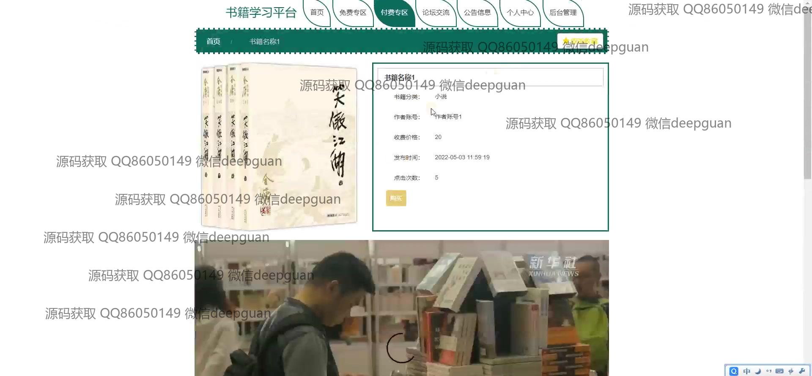
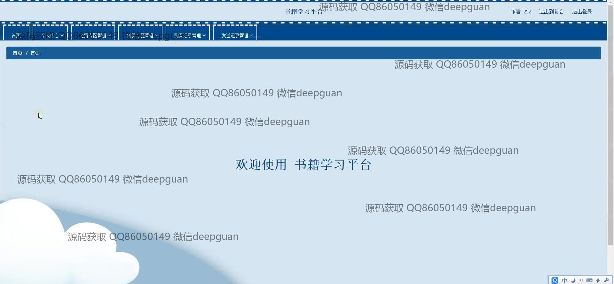
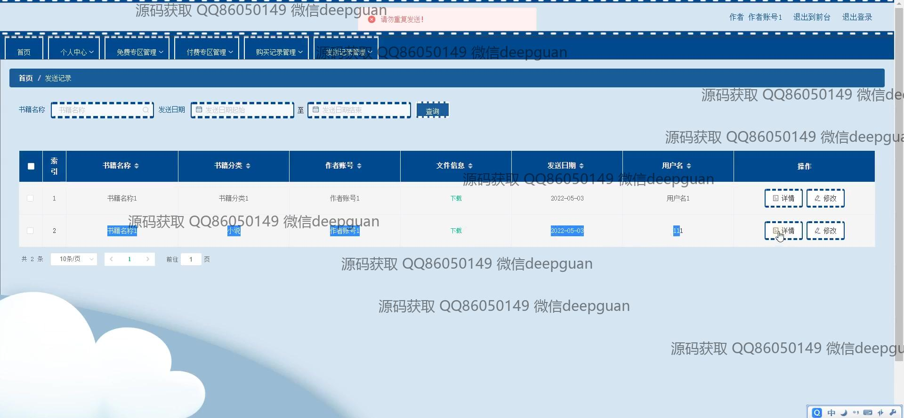
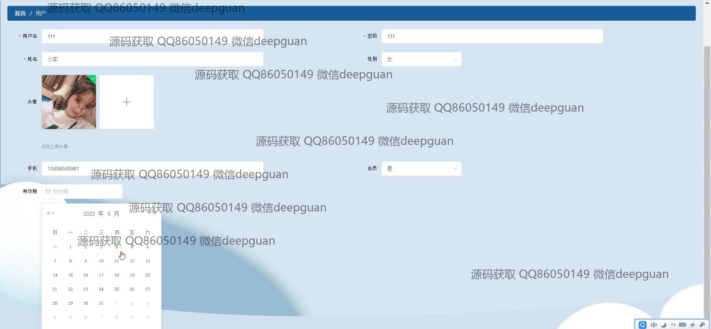

<h1 align="center">书籍学习平台</h1>

## 简介
Spring Boot书籍学习平台：角色分为管理员和用户；用户功能包括注册、个人中心管理、书籍浏览及学习、论坛交流；管理员功能涵盖用户管理、书籍管理、会员管理、消息提醒及系统管理。    --计算机毕业设计源码；毕设源码；java毕业设计源码

## 联系方式

<h3 align="center">获取完整代码与数据库文件 + 微信：deepguan QQ: 86050149 QQ群: 783742310</h3>

<h3 align="center">可帮忙远程部署 包运行成功！提供远程部署、修改代码、设计文档指导、代码讲解等服务！</h3>

## 功能介绍（完整见运行截图）
管理员：管理界面提供轮播图管理、作者管理、用户管理、书籍分类管理、专区管理、发送记录和消息提醒管理等功能。可以查看和编辑作者和用户信息，进行新增、修改和删除操作，管理书籍分类以及专区推荐。可处理评论审核和查看发送记录，确保平台内容的正确性和安全性。

用户：注册界面支持用户信息输入与验证，包括用户名、密码、姓名、手机号等。用户可登录平台后访问首页导航功能，浏览免费专区、付费专区和论坛交流等模块。在个人中心，用户可查看和编辑个人资料信息以及管理会员状态。此外，用户可以参与讨论、查看推荐书籍，并进行购买和收藏操作。

会员：会员用户可通过个人中心查看账户信息、进行会员办理和查看购买记录。系统提供会员价格和办理日期的查询功能。会员期间，用户可访问专属的免费、付费专区，获取更多学习资源和参与更深层次的互动交流。

开发者：利用Spring Boot配置平台，整合注册、管理和用户交互功能，改进界面设计与导航体验。开发者需定期检查错误提示与信息验证模块以提升用户操作流畅度，并确保平台数据的准确性和安全性，支持用户及管理员的高效使用。

## 运行截图

本代码来源于网络,仅供学习参考使用!

